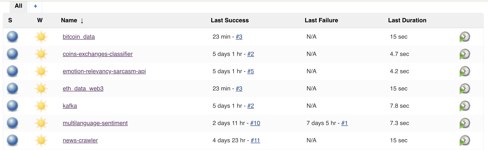

# Documentation for Bitcurate Stack

Documentation to respawn all the backends incase any breakdown and to store any artifacts. **Do not share this repository to unauthorized developers!**

## Table of contents
  * [server](#server)
  * [vault](#vault)
  * [nginx](#nginx)
  * [jenkins](#jenkins)
  * [portainer](#portainer)
  * [how-to-start-backend](#how-to-start-backend)
  * [how-to-start-streaming](#how-to-start-streaming)
  * [how-to-start-capture](#how-to-start-capture)
  * [operations](#operations)
  * [prometheus](#prometheus)
  * [coins-exchanges-classifier](#coins-exchanges-classifier)
  * [emotion-relevancy-sarcasm-api](#emotion-relevancy-sarcasm-api)
  * [multilanguage-sentiment](#multilanguage-sentiment)
  * [summarization-news](#summarization-news)
  * [part-of-speech](#part-of-speech)
  * [kafka](#kafka)
  * [streamz-processing](#streamz-processing)

## server

Our primary server is EC2 instance, name `bitcurate-backend`. Make sure you able to access aws console to view it.

- Name: bitcurate-backend
- Public IP: 18.139.35.113 (reserved IP)
- Public domain: dev.bitcurate.com

To ssh,

```bash
ssh -i 'bitcurate-backend.pem' ubuntu@dev.bitcurate.com
```

## vault

All basic auth in *.dev.bitcurate.com use same password, generated in [/nginx/reverse-proxy/psswd](https://github.com/bitcurate/nginx/blob/master/reverse-proxy/psswd). If you want to replace it, make sure nginx able to use it.

**Username: admin, Password: A5cwn9YVcqnekR6Y**

## [nginx](https://github.com/bitcurate/nginx)

Can readme inside [nginx](https://github.com/bitcurate/nginx) to get better understanding how to configure nginx for bitcurate. Configurations are pretty straightforward for experienced nginx.

## jenkins

Can visit our jenkins dashboard here, http://dev.bitcurate.com:8080/. Login detail in [vault](#vault).

Our primary CICD is jenkins, any master push from our github repositories, it will send a payload to our webhook and jenkins will update the deployments with latest code.

## portainer

Can visit our portainer dashboard here, https://portainer.dev.bitcurate.com/. Login detail in [vault](#vault).

Portainer is our primary docker web management, to check logs and status for our containers. Bitcurate is 100% docker.

## how-to-start-backend

These steps are foundation, any major restart due to any circumstances (scaling instance, AWS error, or anything) need to follow these steps.

### 1. Make sure jenkins are alive,

```bash
sudo service jenkins status
```

If you saw something like,

```text
Jan 06 12:27:23 ip-172-31-42-83 su[1421]: pam_unix(su:session): session opened for user jenkins by (uid=0)
```

You are good to go.

### 2. Visit [jenkins](http://dev.bitcurate.com:8080/),



### 3. Trigger CD by sequence in jenkins,

To trigger any job in jenkins, press right hand side play on selected row. Make sure you follow from 1-8 one-by-one.

1. [Operations](#operations)
2. [prometheus](#prometheus)
3. [coins-exchanges-classifier](#coins-exchanges-classifier)
4. [emotion-relevancy-sarcasm-api](#emotion-relevancy-sarcasm-api)
5. [multilanguage-sentiment](#multilanguage-sentiment)
6. [summarization-news](#summarization-news)
7. [part-of-speech](#part-of-speech)
8. [kafka](#kafka)

## how-to-start-streaming

These steps should be done after [how-to-start-backend](#how-to-start-backend).

These steps to start listen from Twitter, Reddit, Telegram and News, and process almost perfect minibatch realtime processing.

### 1. Visit [jenkins](http://dev.bitcurate.com:8080/),


### 2. Trigger CD by sequence in jenkins,

To trigger any job in jenkins, press right hand side play on selected row. Make sure you follow from 1-4 one-by-one.

1. [twitter-streaming](https://github.com/bitcurate/twitter-streaming)
2. [reddit-crawler](https://github.com/bitcurate/reddit-crawler)
3. [streamz-processing](#streamz-processing)
4. [news-crawler](#https://github.com/bitcurate/news-crawler)

## how-to-start-capture

These steps should be done after [how-to-start-backend](#how-to-start-backend).

These steps to start listen to Bitcoin blockchain, Ethereum gas and CCXT.

### 1. Visit [jenkins](http://dev.bitcurate.com:8080/),


### 2. Trigger CD by sequence in jenkins,

To trigger any job in jenkins, press right hand side play on selected row. Make sure you follow from 1-2 one-by-one.

1. [bitcoin_data](https://github.com/bitcurate/bitcoin_data)
2. [eth_data_web3](https://github.com/bitcurate/eth_data_web3)

## operations

This repository, https://github.com/bitcurate/Operations, to store bitcurate operation tools. These are some important tools bitcurate engineers use it in daily life, Login detail in [vault](#vault),

1. [netdata, to view server resources](https://netdata.dev.bitcurate.com/)
2. [cerebro, elasticsearch manager](https://cerebro.dev.bitcurate.com/)
3. [kibana, elasticsearch web ui](https://kibana.dev.bitcurate.com/)
4. [airflow, bitcurate scheduling engine](https://airflow.dev.bitcurate.com/)

## prometheus

This repository, https://github.com/bitcurate/prometheus, to give alert for any anomaly happened in slack, realtime. For more details, read readme in https://github.com/bitcurate/prometheus.

1. [prometheus dashboard](https://prometheus.dev.bitcurate.com/)
2. [alert manager dashboard](https://alertmanager.dev.bitcurate.com/)

## coins-exchanges-classifier

This repository, https://github.com/bitcurate/coins-exchanges-classifier, to classify coins and exchanges mentioned in a string.

## emotion-relevancy-sarcasm-api

This repository, https://github.com/bitcurate/emotion-relevancy-sarcasm-api, to classify emotions, feargreed score, relevancy and sarcasm in a string.

Can visit [multipurpose.dev.bitcurate.com](multipurpose.dev.bitcurate.com) to play around this API.

## multilanguage-sentiment

This repository, https://github.com/bitcurate/sentiment-multilanguage, to classify sentiment in multilanguage.

To get languages supported, https://github.com/bitcurate/sentiment-multilanguage/tree/master/notebooks

Can visit [sentiment.dev.bitcurate.com](sentiment.dev.bitcurate.com) to play around this API.

## summarization-news

This repository, https://github.com/bitcurate/summarization-news, to build extractive summary for a very long news. Primarily used in news crawler.

## part-of-speech

This repository, https://github.com/bitcurate/part-of-speech, to extract entities related for a string. Primarily used in news crawler.

## kafka

This repository, https://github.com/bitcurate/kafka, to store kafka settings and manifests. **Do not edit it unless you know what happened, kafka is really easy to break**.

Kafka manager, https://kafdrop.dev.bitcurate.com/

## streamz-processing

This repository, https://github.com/bitcurate/streamz-processing, to do distributed minibatch realtime processing using Streamz and Dask, classify strings. For more details, read readme in https://github.com/bitcurate/streamz-processing.

